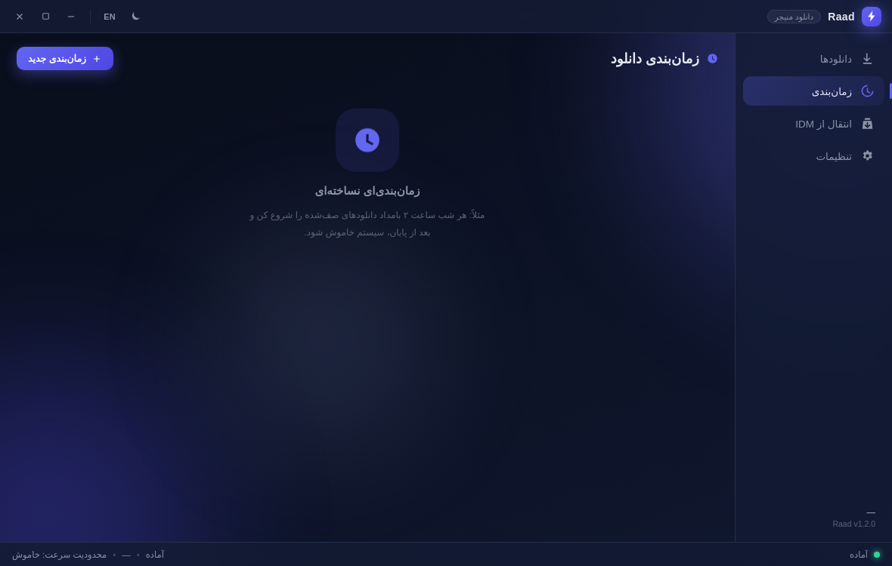
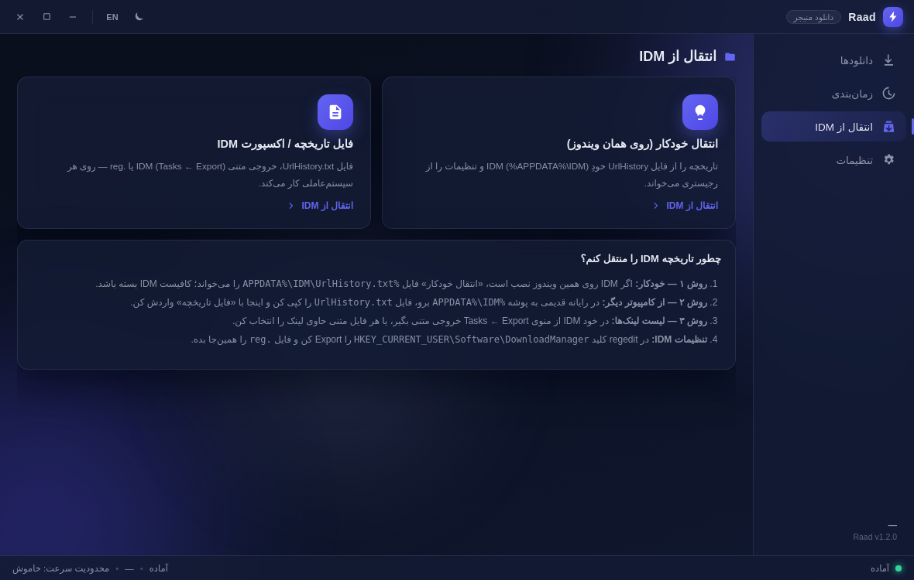
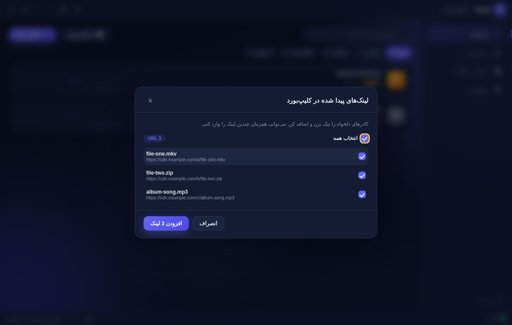
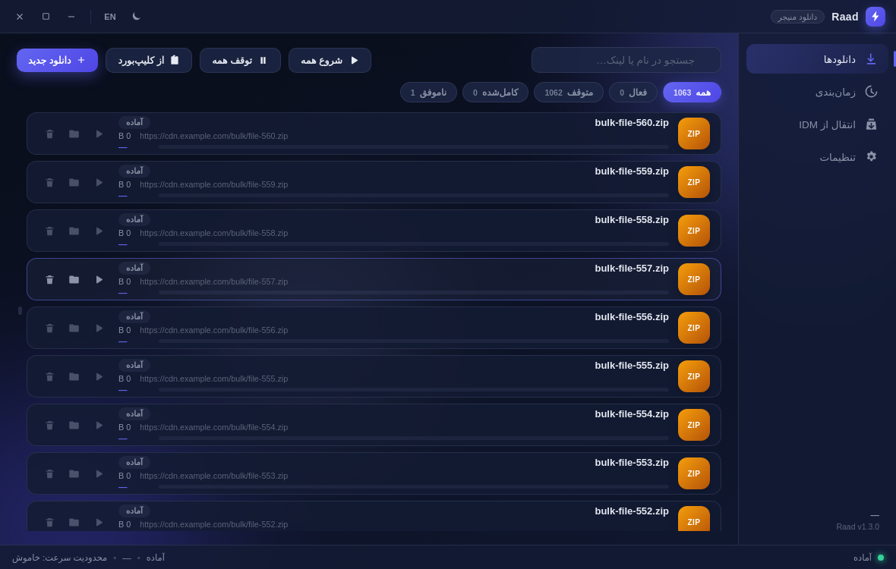

<div align="center">

[](README.md)&nbsp;[](README.en.md)


# ⚡ رعد — دانلود منیجر مدرن جایگزین IDM

[](../../releases/latest)
[](../../releases)
[](https://www.electronjs.org/)
[](LICENSE)

</div>

<div dir="rtl">

**رعد** (به‌معنای آذرخش) یک دانلود منیجر مدرن، متن‌باز (MIT) و کاملاً **پرتابل** ساخته‌شده با **Electron** است — طراحی‌شده به‌عنوان جایگزین واقعی IDM: موتور دانلود چندتکه، توقف/ادامه، زمان‌بندی، واردکردن گروهی از کلیپ‌بورد، افزونه کروم/فایرفاکس و انتقال واقعی و کامل تاریخچه IDM.

> **پرتابل، بدون نصب‌کننده.** فایل `RaadDM-Portable-x.x.x.exe` را از [Releases](../../releases/latest) بگیر، دوبار کلیک کن — تمام. همه داده‌ها در پوشه `Raad-Data` کنار همان فایل ذخیره می‌شود و هیچ چیزی در رجیستری نصب نمی‌شود.

## 📖 فهرست

- [چرا رعد؟](#چرا-رعد)
- [امکانات](#امکانات)
- [گالری رابط کاربری](#گالری-رابط-کاربری)
- [نصب](#نصب)
- [شروع سریع](#شروع-سریع)
- [انتقال تاریخچه و تنظیمات از IDM](#انتقال-تاریخچه-و-تنظیمات-از-idm)
- [افزونه مرورگر (کروم و فایرفاکس)](#افزونه-مرورگر-کروم-و-فایرفاکس)
- [محدودیت‌های شناخته‌شده](#محدودیتهای-شناختهشده)
- [نقشه راه](#نقشه-راه)
- [سوالات متداول](#سوالات-متداول)
- [ساخت از سورس](#ساخت-از-سورس)
- [ساختار پروژه و معماری](#ساختار-پروژه-و-معماری)
- [مشارکت](#مشارکت)
- [مجوز](#مجوز)

## چرا رعد؟

IDM سال‌هاست استاندارد طلایی دانلود منیجرهاست، اما پولی است، منبع‌بسته است و برای کاربر فارسی‌زبان همیشه یک رابط ترجمه‌شده ناقص بوده است. رعد از صفر و با اولویت زبان فارسی ساخته شده: همانی که تا امروز روی نسخه 1.5 آزموده شده — موتور دانلود چندتکه‌ای که با مقایسه MD5 تایید شده است که بایت‌به‌بایت فایل سالم تحویل می‌دهد، و مهاجرتی که «کل لیست داخل خود IDM» را با تاریخ و وضعیت کامل منتقل می‌کند.

| | رعد | IDM |
|---|---|---|
| **مجوز** | رایگان، متن‌باز (MIT) | تجاری — ۳۰ روز آزمایش، سپس خرید |
| **نصب** | پرتابل؛ فقط یک فایل exe، بدون نصب | نصب‌کننده + ادغام با مرورگر |
| **رابط فارسی و RTL** | کامل و بومی (فونت وزیرمتن داخل بسته) | ترجمه ناقص |
| **دانلود چندتکه** | تا ۳۲ اتصال موازی | تا ۳۲ اتصال موازی |
| **توقف / ادامه** | ✅ حتی بعد از بستن برنامه | ✅ |
| **انتقال تاریخچه IDM** | ✅ کامل از رجیستری، با تاریخ و وضعیت «کامل‌شده» | — |
| **منبع باز و قابل بررسی** | ✅ | ❌ |

## ✨ امکانات

### 🚀 موتور دانلود
- **دانلود چندتکه** — تا ۳۲ اتصال موازی برای هر فایل، مثل IDM؛ پشتیبانی از ریدایرکت‌های CDN و سرورهایی که Range را پشتیبانی نمی‌کنند
- **توقف / ادامه / از سرگیری** — حتی بعد از بستن برنامه (فایل state کنار فایل ناتمام ذخیره می‌شود)
- **صف دانلود** — تعداد دانلود همزمان قابل تنظیم؛ شروع/توقف گروهی فقط در بخش زمان‌بندی است تا یک کلیک اشتباهی اینترنت را اشغال نکند
- **محدودیت سرعت کلی** — بدون قطع یا لطمه به دانلودهای فعال
- سالم بودن فایل خروجی با مقایسه MD5 در برابر فایل مرجع تست شده است

### 🗂 سازماندهی و مدیریت
- **دسته‌بندی مثل IDM** — ویدیو/صدا/عکس/آرشیو/برنامه/مدرک، هرکدام **پوشه ذخیره جداگانه** یا زیرپوشه خودکار
- **مرتب‌سازی** (جدیدترین/قدیمی‌ترین/نام) و **فیلتر تاریخ** (امروز / ۷ روز / ۳۰ روز)
- **رندر پنجره‌ای لیست** — فقط ردیف‌های قابل مشاهده ساخته می‌شوند؛ حتی با هزاران آیتم رابط روان می‌ماند و ردیف‌ها هرگز روی هم نمی‌افتند
- دوبار-کلیک روی ردیف = اجرای فایل؛ دکمه‌های عملیات روی هر ردیف

### ⏰ اتوماسیون
- **زمان‌بندی** — بازه‌های روزانه/هفتگی + گزینه خاموش‌کردن خودکار سیستم پس از خالی‌شدن صف
- **مانیتور کلیپ‌بورد** — تشخیص خودکار یک یا چند لینک کپی‌شده + افزودن گروهی با تیک

### 🔄 سازگاری و انتقال
- **انتقال کامل از IDM** — کل لیست، از رجیستری ویندوز و فایل‌های UrlHistory (توضیح کامل در بخش [انتقال از IDM](#انتقال-تاریخچه-و-تنظیمات-از-idm))
- **افزونه کروم و فایرفاکس** (آزمایشی) — پنجره شناور دانلود به سبک IDM؛ وضعیت فعلی را در بخش [افزونه مرورگر](#افزونه-مرورگر-کروم-و-فایرفاکس) بخوانید

### 🎨 ظاهر و شخصی‌سازی
- **تیره/روشن × ۳ قالب** (شیشه‌ای، فلت، نرم) × ۶ رنگ آماده + **رنگ دلخواه** + گردی گوشه‌ها + اندازه متن + شدت نور پس‌زمینه (ثابت، بدون انیمیشن) + حالت فشرده
- **دوزبانه** — فارسی/انگلیسی با جهت RTL/LTR خودکار؛ فونت وزیرمتن داخل بسته
- **سبک و پایدار** — بدون فرآیند GPU (شتاب‌دهنده گرافیکی خاموش)، آیکون و نام «Raad Download Manager» در Task Manager

## 🖼 گالری رابط کاربری

| لیست دانلود | حالت روشن |
|---|---|
|  |  |

| لیست با ۱۰۰۰+ آیتم (رندر پنجره‌ای) | دسته‌بندی‌ها (پوشه جدا برای هر نوع فایل) |
|---|---|
|  |  |

| زمان‌بندی | انتقال از IDM |
|---|---|
|  |  |

| افزودن گروهی از کلیپ‌بورد | تنظیمات ظاهر |
|---|---|
|  |  |

| پنجره شناور دانلود (سبک IDM) | حالت فشرده |
|---|---|
|  |  |

## 📥 نصب

1. از صفحه [Releases](../../releases/latest) فایل **`RaadDM-Portable-1.5.0.exe`** را دانلود کن.
2. دوبار کلیک کن. اجرای اول چند ثانیه بیشتر طول می‌کشد (برنامه خودش را در پوشه موقت ویندوز باز می‌کند — طبیعی است).
3. اگر SmartScreen هشدار داد: `More info → Run anyway` (چون فایل امضای دیجیتال ندارد؛ توضیح بیشتر در [سوالات متداول](#سوالات-متداول)).
4. حذف کامل برنامه = پاک کردن فایل exe و پوشه `Raad-Data` کنارش. هیچ چیزی در رجیستری نصب نمی‌شود.

پیش‌نیاز: Windows 10/11 (64-bit).

## 🚀 شروع سریع

1. **اولین دانلود:** دکمه افزودن (یا `Ctrl+N`) → لینک را بچسبان → شروع. رعد خودش نوع فایل را تشخیص می‌دهد و در پوشه دسته مناسب می‌گذارد.
2. **مانیتور کلیپ‌بورد:** هر لینکی که کپی کنی، رعد پیشنهاد دانلود می‌دهد — برای چند لینک هم‌زمان، پنجره گروهی با تیک باز می‌شود.
3. **انتقال از IDM:** یک‌بار «انتقال خودکار» را بزن؛ کل تاریخچه با وضعیت «کامل‌شده» و ترتیب خود IDM می‌نشیند (هیچ‌چیز خودکار دانلود نمی‌شود).
4. **دسته‌بندی‌ها:** در بخش «دسته‌بندی‌ها» پوشه ذخیره هر نوع فایل را یک‌بار تعیین کن؛ از آن بعد همه‌چیز خودش مرتب می‌شود.
5. **ظاهر:** از تنظیمات، تم تیره/روشن، رنگ و حالت فشرده را به سلیقه خودت تنظیم کن.

## 🔄 انتقال تاریخچه و تنظیمات از IDM

لیست اصلی IDM (همان چیزی که در پنجره‌اش می‌بینی) داخل **رجیستری ویندوز** ذخیره می‌شود: هر دانلود یک زیرکلید عددی است (`HKEY_CURRENT_USER\Software\DownloadManager\<شماره>`) که آدرس فایل در مقدار `Url0` آن است — همان منبعی که ابزارهای بکاپ/بازیابی IDM استفاده می‌کنند و به همین دلیل بعد از تعویض ویندوز، هزاران رکورد برمی‌گردد. فایل `UrlHistory.txt` هم فقط آینه‌ی فعالیت‌های اخیر است.

«انتقال خودکار» رعد **هر دو منبع** را می‌خواند و یکی می‌کند — فرقی نمی‌کند فایل‌ها سال‌هاست پاک شده باشند؛ همه می‌آیند (تا ۲۰٬۰۰۰ مورد، با ادغام و حذف تکراری‌ها). موارد واردشده **«کامل‌شده»** و دقیقاً **به ترتیب لیست IDM** (بر اساس شماره زیرکلید، جدیدترین بالا) می‌نشینند و **هیچ‌کدام خودکار دانلود نمی‌شود** — دانلود دوباره فقط با کلیک خودت است:


| روش | توضیح |
|---|---|
| **خودکار** (همان ویندوز) | در برنامه: «انتقال از IDM ← انتقال خودکار» — کل درخت `HKEY_CURRENT_USER\Software\DownloadManager` (همه زیرکلیدهای رکورد با `Url0`) با `reg export` یونیکد + همه فایل‌های `UrlHistory*` در `%APPDATA%\IDM`. فقط IDM باید بسته باشد. |
| **فایل تاریخچه** | از رایانه قدیمی: در `regedit` کلید `HKEY_CURRENT_USER\Software\DownloadManager` را Export کن، یا `%APPDATA%\IDM\UrlHistory.txt` را کپی کن ← در رعد: «فایل تاریخچه / اکسپورت IDM» |
| **لیست لینک** | در خود IDM منوی `Tasks → Export` (خروجی متنی) یا هر فایل متنی حاوی لینک |

## 🌐 افزونه مرورگر (کروم و فایرفاکس)

> ⚠️ **وضعیت در نسخه ۱.۵:** پل اتصال افزونه‌ها هنوز **آزمایشی** است و در برخی سیستم‌ها اتصال افزونه به برنامه برقرار نمی‌شود. این یک مشکل شناخته‌شده است، در اولویت [نقشه راه](#نقشه-راه) قرار دارد و به‌محض پایدارشدن اعلام خواهد شد. سایر قابلیت‌های برنامه به‌طور کامل و پایدار کار می‌کنند.

نصب دستی (برای تست):

| کروم / Edge / Brave | فایرفاکس |
|---|---|
| `chrome://extensions` → Developer mode → **Load unpacked** → پوشه `extension/chrome` | `about:debugging#/runtime/this-firefox` → **Load Temporary Add-on** → فایل `extension/firefox/manifest.json` |

سپس در برنامه رعد: **تنظیمات ← افزونه مرورگر ← کپی JSON** و در پاپ‌آپ افزونه Paste و Save کن.

- کلیک روی **دکمه بزرگ ON/OFF** بالای پاپ‌آپ افزونه = فعال/غیرفعال کردن شنود دانلودها
- راست‌کلیک در صفحه ← «Disable/Enable Raad interception»
- در حالت اتصال: کلیک روی لینک دانلود در مرورگر ← پنجره شناور رعد باز می‌شود و دانلود با رعد ادامه پیدا می‌کند

## ⚠️ محدودیت‌های شناخته‌شده

شفاف‌بودن بهتر از وعده‌ی توخالی است — این‌ها وضعیت واقعی نسخه 1.5 هستند:

1. **اتصال افزونه کروم/فایرفاکس** هنوز ناپایدار است و در برخی سیستم‌ها برقرار نمی‌شود — اولویت اول نسخه بعدی.
2. **امضای دیجیتال نداریم**؛ SmartScreen و برخی آنتی‌ویروس‌ها ممکن است هشدار بدهند (کاملاً طبیعی است — سورس باز است و می‌توانی خودت بیلد کنی).
3. **اجرای اول کمی کند** است چون پرتابل self-extract است؛ اجراهای بعدی سریع‌اند.
4. فعلاً **فقط ویندوز** — نسخه لینوکس/مک در نقشه راه است.

## 🗺 نقشه راه

- ✅ موتور دانلود چندتکه + توقف/ادامه + محدودیت سرعت (تاییدشده با MD5)
- ✅ انتقال کامل تاریخچه IDM از رجیستری + UrlHistory
- ✅ دسته‌بندی‌ها، زمان‌بندی، مانیتور کلیپ‌بورد
- ✅ تم تیره/روشن × ۳ قالب × رنگ دلخواه، دوزبانه RTL/LTR
- 🔧 **در حال کار:** پایدارسازی پل اتصال افزونه‌های کروم/فایرفاکس
- 🔜 بعدی: انتشار افزونه در Chrome Web Store و addons.mozilla.org، امضای کد، بهبود مصرف منابع، نسخه لینوکس

## ❓ سوالات متداول

**آنتی‌ویروس یا SmartScreen روی فایل پرتابل هشدار می‌دهد، خطرناک است؟**
نه. فایل امضای دیجیتال ندارد و پرتابل‌های self-extract گاهی هشدار می‌گیرند. کل سورس باز است (MIT) — می‌توانی خودت `npm run dist:win` بزنی و هم‌فایلِ بیلد کنی.

**داده‌ها کجا ذخیره می‌شوند؟ حذف برنامه چطور است؟**
همه‌چیز در پوشه `Raad-Data` کنار فایل exe. هیچ چیزی در رجیستری یا AppData نوشته نمی‌شود؛ حذف کامل = پاک کردن exe و همان پوشه.

**برای انتقال تاریخچه، باید IDM نصب باشد؟**
نه. اگر IDM روی همان ویندوز نصب باشد «انتقال خودکار» مستقیم از رجیستری می‌خواند؛ وگرنه از رایانه قدیمی فایل Registry Export یا `UrlHistory.txt` را بردار و از طریق «فایل تاریخچه» وارد کن.

**آیا موارد واردشده از IDM خودکار دانلود می‌شوند؟**
هرگز. همه با وضعیت «کامل‌شده» می‌نشینند و دانلود دوباره فقط با کلیک خودت شروع می‌شود.

**چند زبان پشتیبانی می‌شود؟**
فارسی و انگلیسی؛ جهت رابط (RTL/LTR) خودکار عوض می‌شود و فونت وزیرمتن داخل بسته است.

## 🛠 ساخت از سورس

```bash
git clone https://github.com/abalfazljam/raad.git
cd raad
npm install
npm start            # اجرای مستقیم (سورس)
npm run dist:win     # ساخت RaadDM-Portable.exe ویندوز (پرتابل)
```

پیش‌نیاز: Node.js 18+. بیلد ویندوز روی لینوکس هم انجام می‌شود (makensis نیتیو، بدون Wine).

## 🧱 ساختار پروژه و معماری

```
main/       → موتور دانلود (چندتکه + صف + محدودیت سرعت)، زمان‌بند، پل HTTP افزونه‌ها، پارسر IDM
preload/    → پل امن (contextIsolation) به‌صورت window.raad
renderer/   → رابط کاربری (JS خالص + CSS، بدون فریمورک) + پنجره شناور دانلود
extension/  → افزونه Chrome (MV3) و Firefox (MV2) + راهنما
native/     → (اختیاری) هاست Native Messaging
scripts/    → ساخت آیکون، تست پارسر IDM، بسته‌بندی
```

- **صفر وابستگی runtime** — فقط Electron؛ موتور دانلود روی `electron.net`
- ذخیره‌سازی JSON اتمیک (بدون SQLite، بدون native module)
- پل افزونه‌ها: HTTP لوکال `127.0.0.1` با توکن امنیتی قابل بازیابی

## 🤝 مشارکت

مشارکت‌ها خوشامدند! برای باگ، اول یک [Issue](../../issues/new) با توضیح دقیق (نسخه ویندوز، مراحل بازتولید و در صورت امکان لاگ‌های `Raad-Data`) باز کن. برای تغییر کد: fork کن، شاخه بساز (`feature/my-feature`)، تغییرات را با کامیت‌های تمیز push کن و Pull Request بزن. اگر روی پل افزونه‌ها یا موتور دانلود کار می‌کنی، لطفاً اول در یک Issue هماهنگ کن.

## 📄 مجوز

MIT — رایگان برای استفاده شخصی و تجاری. فونت [وزیرمتن](https://github.com/rastikerdar/vazirmatn) تحت مجوز SIL OFL داخل بسته است. ساخته‌شده با ⚡ برای کاربران فارسی‌زبان و همه جای دنیا.

</div>
