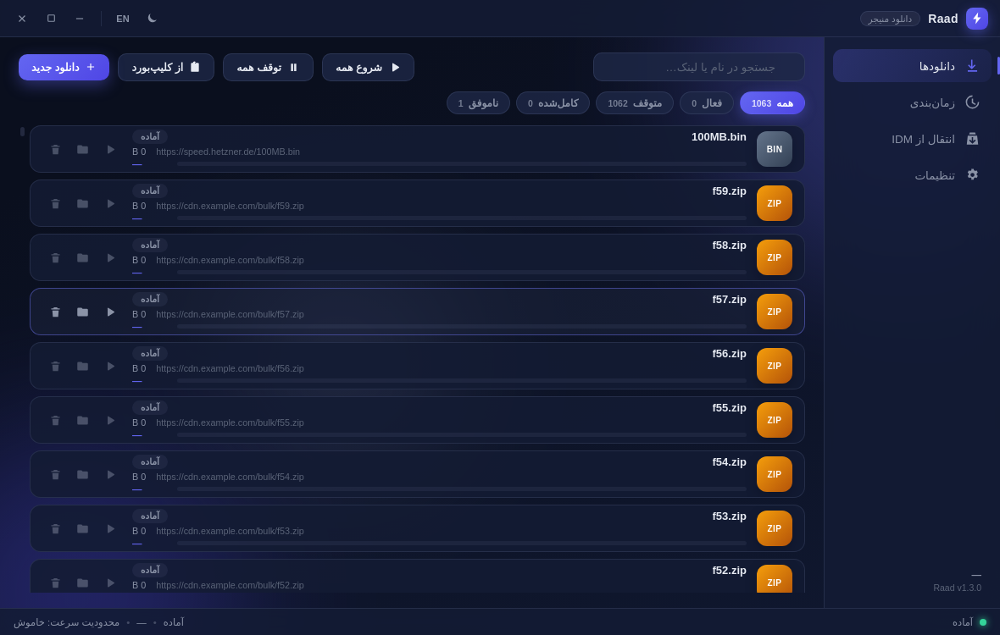
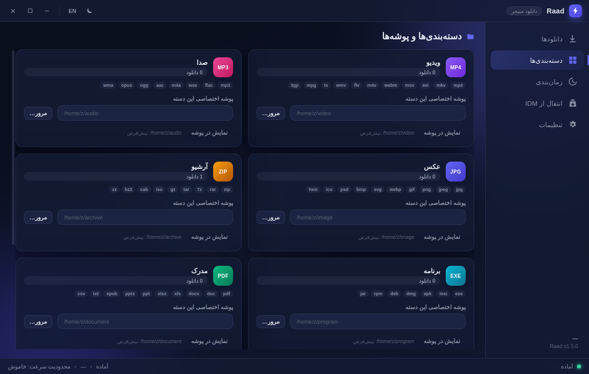

<div align="center">

[](README.md)&nbsp;[](README.en.md)

</div>

<div dir="rtl">

# ⚡ رعد — دانلود منیجر مدرن جایگزین IDM

[](../../releases/latest)
[](../../releases)
[](https://www.electronjs.org/)
[](LICENSE)

**رعد** یک دانلود منیجر مدرن، متن‌باز (MIT) و **پرتابل** ساخته‌شده با **Electron** است — طراحی‌شده به‌عنوان جایگزین واقعی IDM: موتور دانلود چندتکه، توقف/ادامه، زمان‌بندی، واردکردن گروهی از کلیپ‌بورد، افزونه کروم/فایرفاکس با پنجره دانلود شناور و انتقال واقعی تاریخچه IDM.

> **پرتابل، بدون نصب‌کننده.** فایل `RaadDM-Portable-x.x.x.exe` را از [Releases](../../releases/latest) بگیر، دوبار کلیک کن — تمام. همه داده‌ها در پوشه `Raad-Data` کنار همان فایل ذخیره می‌شود.

| لیست دانلود | تنظیمات ظاهر |
|---|---|
|  |  |

---

## ✨ امکانات

- 🚀 **موتور دانلود چندتکه** — تا ۳۲ اتصال موازی برای هر فایل، مثل IDM؛ ریدایرکت‌های CDN، توقف/ادامه و محدودیت سرعت کاملاً کارا و تست‌شده با مقایسه MD5 فایل مرجع
- ⏸ **توقف / ادامه / از سرگیری** — حتی بعد از بستن برنامه (فایل state کنار فایل ناتمام ذخیره می‌شود)
- 📥 **صف دانلود** — تعداد دانلود همزمان قابل تنظیم؛ شروع/توقف گروهی فقط در بخش زمان‌بندی (تا یک کلیک اشتباهی اینترنت را اشغال نکند)
- 🗂 **دسته‌بندی مثل IDM** — ویدیو/صدا/عکس/آرشیو/برنامه/مدرک هرکدام **پوشه ذخیره جداگانه** (بخش «دسته‌بندی‌ها») یا زیرپوشه خودکار
- 🐢 **محدودیت سرعت کلی** — بدون قطع دانلودها
- ⏰ **زمان‌بندی** — بازه‌های روزانه/هفتگی + گزینه خاموش‌کردن خودکار سیستم پس از خالی‌شدن صف
- 📋 **مانیتور کلیپ‌بورد** — تشخیص خودکار یک یا چند لینک کپی‌شده + افزودن گروهی با تیک
- 🌐 **افزونه کروم و فایرفاکس** — کلیک روی لینک دانلود ← پنجره شناور رعد (تجربه IDM)؛ با یک کلیک فعال/غیرفعال می‌شود (بج OFF روی آیکون)
- 🔄 **انتقال از IDM** — «کل لیست داخل خود IDM» مستقیم از رکوردهای رجیستری ویندوز (`DownloadManager\<شماره>` با مقدار `Url0` — همان منبعی که ابزارهای بکاپ IDM می‌خوانند) + همه فایل‌های `UrlHistory*` (ادغام و حذف تکراری، تا ۲۰٬۰۰۰ مورد). حتی اگر فایل‌ها سال‌هاست پاک شده باشند همه می‌آیند؛ موارد مثل لیست خود IDM «کامل‌شده» و به همان ترتیب لیست IDM (جدیدترین بالا) وارد می‌شوند و **هیچ‌کدام خودکار دانلود نمی‌شود** — دانلود دوباره فقط با کلیک خودت
- 🎨 **ظاهر کاملاً شخصی‌سازی‌شدنی** — تیره/روشن × ۳ قالب (شیشه‌ای، فلت، نرم) × ۶ رنگ آماده + **رنگ دلخواه** + گردی گوشه‌ها + اندازه متن + شدت نور پس‌زمینه (ثابت، بدون انیمیشن) + حالت فشرده
- 🌍 **دوزبانه** — فارسی/انگلیسی، جهت RTL/LTR خودکار، فونت وزیرمتن داخل بسته
- ⚡ **سبک و پایدار** — بدون فرآیند GPU (شتاب‌دهنده گرافیکی خاموش)، فایل اجرایی با آیکون و نام «Raad Download Manager» در Task Manager

## 🖼 لیست دانلود (بازطراحی‌شده)

| لیست با ۱۰۰۰+ آیتم (رندر پنجره‌ای) | حالت روشن |
|---|---|
|  |  |

| دسته‌بندی‌ها (پوشه جدا برای هر نوع فایل) | پنجره شناور دانلود (مثل IDM) |
|---|---|
|  |  |

ردیف‌های هم‌اندازه با ارتفاع ثابت: نام فایل + آدرس + نوار پیشرفت + حجم/**تاریخ** + دکمه‌های عملیات — دوبار-کلیک = اجرای فایل. فقط ردیف‌های قابل مشاهده ساخته می‌شوند، پس حتی با هزاران آیتم رابط روان می‌ماند و ردیف‌ها هرگز روی هم نمی‌افتند. نوار ابزار **مرتب‌سازی** (جدیدترین/قدیمی‌ترین/نام) و **فیلتر تاریخ** (امروز/۷ روز/۳۰ روز) دارد؛ موارد واردشده از IDM مثل لیست خود IDM «کامل‌شده» دیده می‌شوند و دانلود دوباره فقط با کلیک خودت است.

## 📥 نصب (بدون نصب‌کننده، بدون دستور)

1. از صفحه [Releases](../../releases/latest) فایل **`RaadDM-Portable-x.x.x.exe`** را دانلود کن.
2. دوبار کلیک کن. اجرای اول چند ثانیه بیشتر طول می‌کشد (برنامه خودش را در پوشه موقت ویندوز باز می‌کند — طبیعی است).
3. اگر SmartScreen هشدار داد: `More info → Run anyway` (چون فایل امضای دیجیتال ندارد).
4. حذف کامل برنامه = پاک کردن فایل exe و پوشه `Raad-Data` کنارش. هیچ چیزی در رجیستری نصب نمی‌شود.

## 🌐 نصب افزونه مرورگر

| کروم / Edge / Brave | فایرفاکس |
|---|---|
| `chrome://extensions` → Developer mode → **Load unpacked** → پوشه `extension/chrome` | `about:debugging#/runtime/this-firefox` → **Load Temporary Add-on** → فایل `extension/firefox/manifest.json` |

سپس در برنامه رعد: **تنظیمات ← افزونه مرورگر ← کپی JSON** و در پاپ‌آپ افزونه Paste و Save کن.

- کلیک روی **دکمه بزرگ ON/OFF** بالای پاپ‌آپ افزونه = فعال/غیرفعال کردن شنود دانلودها
- راست‌کلیک در صفحه ← «Disable/Enable Raad interception»
- بعد از آن: کلیک روی هر لینک دانلود در مرورگر ← پنجره شناور رعد باز می‌شود و دانلود با رعد ادامه پیدا می‌کند

## 🔄 انتقال تاریخچه و تنظیمات IDM

لیست اصلی IDM (همان چیزی که در پنجره‌اش می‌بینی) داخل **رجیستری ویندوز** ذخیره می‌شود: هر دانلود یک زیرکلید عددی است (`HKEY_CURRENT_USER\Software\DownloadManager\<شماره>`) که آدرس فایل در مقدار `Url0` آن است — همان منبعی که ابزارهای بکاپ/بازیابی IDM استفاده می‌کنند و به همین دلیل بعد از تعویض ویندوز، هزاران رکورد برمی‌گردد. فایل `UrlHistory.txt` هم فقط آینه‌ی فعالیت‌های اخیر است. «انتقال خودکار» رعد **هر دو منبع** را می‌خواند و یکی می‌کند — فرقی نمی‌کند فایل‌ها پاک شده باشند؛ همه می‌آیند. موارد واردشده **«کامل‌شده»** و دقیقاً **به ترتیب لیست IDM** (بر اساس شماره زیرکلید، جدیدترین بالا) می‌نشینند و هیچ‌کدام خودکار دانلود نمی‌شود:

| روش | توضیح |
|---|---|
| **خودکار** (همان ویندوز) | در برنامه: «انتقال از IDM ← انتقال خودکار» — کل درخت `HKEY_CURRENT_USER\Software\DownloadManager` (همه زیرکلیدهای رکورد با `Url0`) با `reg export` یونیکد + همه فایل‌های `UrlHistory*` در `%APPDATA%\IDM`. فقط IDM باید بسته باشد. |
| **فایل تاریخچه** | از رایانه قدیمی: در `regedit` کلید `HKEY_CURRENT_USER\Software\DownloadManager` را Export کن، یا `%APPDATA%\IDM\UrlHistory.txt` را کپی کن ← در رعد: «فایل تاریخچه / اکسپورت IDM» |
| **لیست لینک** | در خود IDM منوی `Tasks → Export` (خروجی متنی) یا هر فایل متنی حاوی لینک |

## 🛠 ساخت از سورس

```bash
git clone https://github.com/abalfazljam/raad.git
cd raad
npm install
npm start            # اجرای مستقیم (سورس)
npm run dist:win     # ساخت RaadDM-Portable.exe ویندوز (پرتابل)
```

پیش‌نیاز: Node.js 18+ . بیلد ویندوز روی لینوکس هم انجام می‌شود (makensis نیتیو، بدون Wine).

## 🧱 ساختار پروژه

```
main/       → موتور دانلود (چندتکه + صف + محدودیت سرعت)، زمان‌بند، پل HTTP افزونه‌ها، پارسر IDM
preload/    → پل امن (contextIsolation) به‌صورت window.raad
renderer/   → رابط کاربری (JS خالص + CSS، بدون فریمورک) + پنجره شناور دانلود
extension/  → افزونه Chrome (MV3) و Firefox (MV2) + راهنما
native/     → (اختیاری) هاست Native Messaging
scripts/    → ساخت آیکون، تست پارسر IDM، بسته‌بندی
```

- **صفر وابستگی runtime** — فقط Electron؛ موتور دانلود روی `electron.net`
- ذخیره‌سازی JSON اتمیک (بدون SQLite، بدون native module)
- پل افزونه‌ها: HTTP لوکال `127.0.0.1` با توکن امنیتی قابل بازیابی

## 📄 مجوز

MIT — رایگان برای استفاده شخصی و تجاری. ساخته‌شده با ⚡ برای کاربران فارسی‌زبان و همه جای دنیا.

</div>
