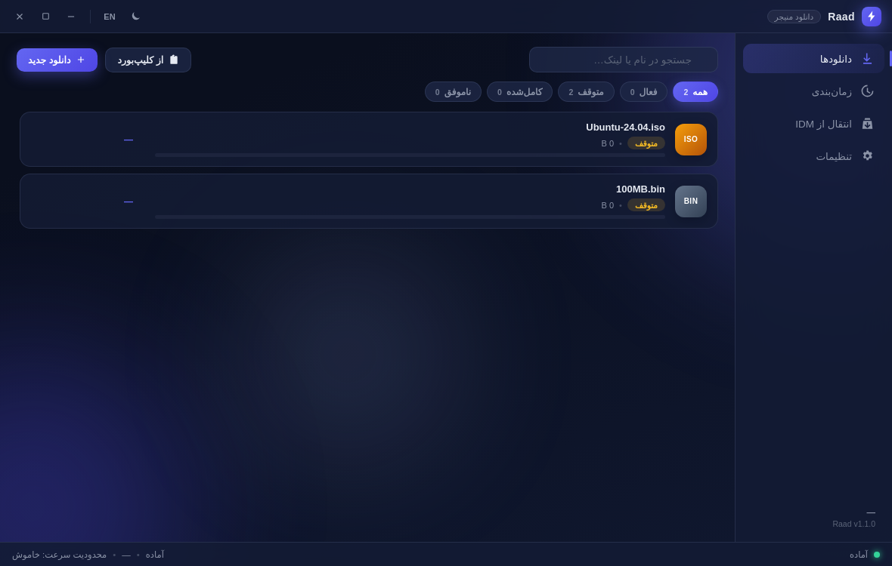
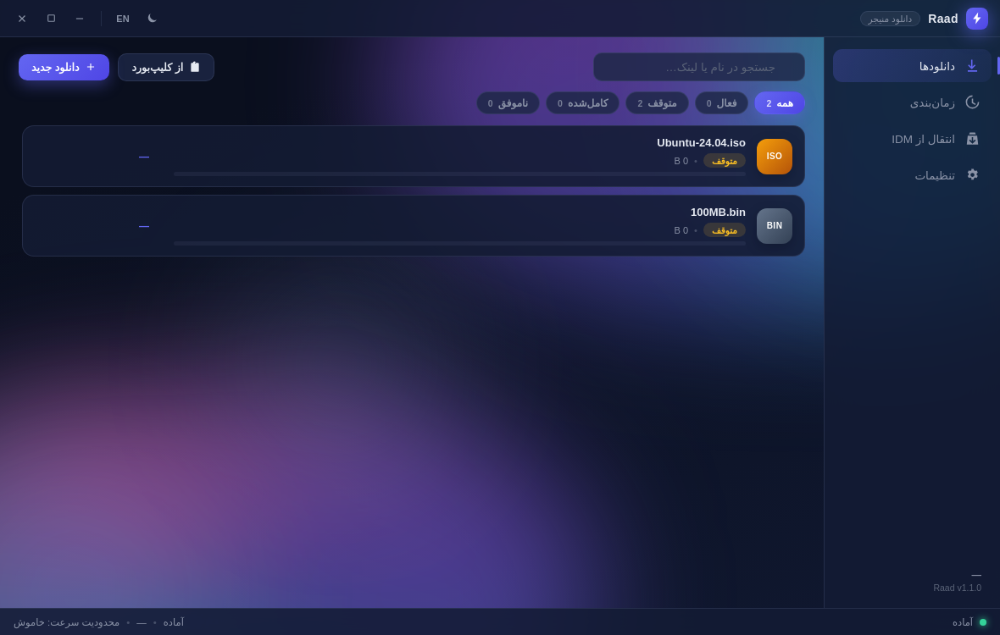
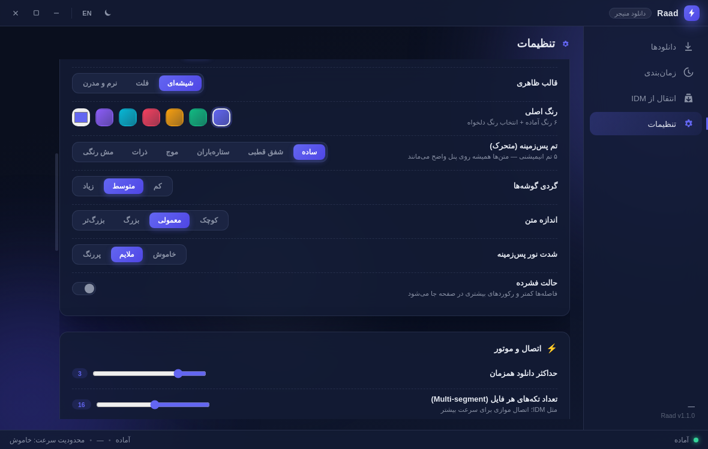
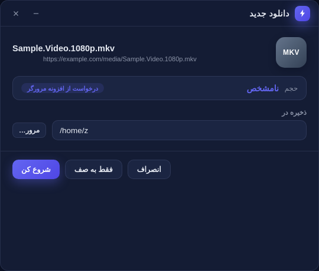
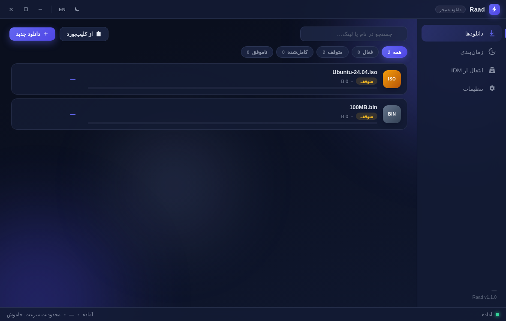
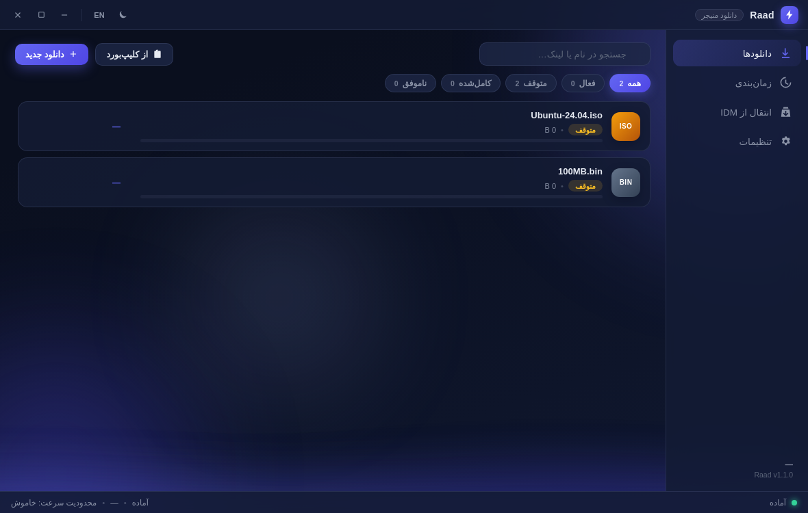
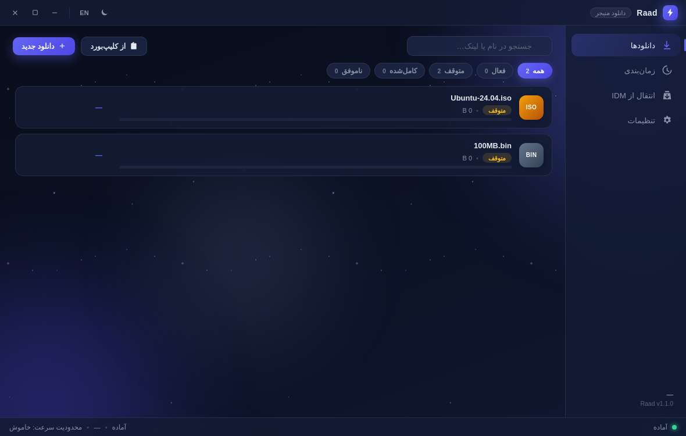
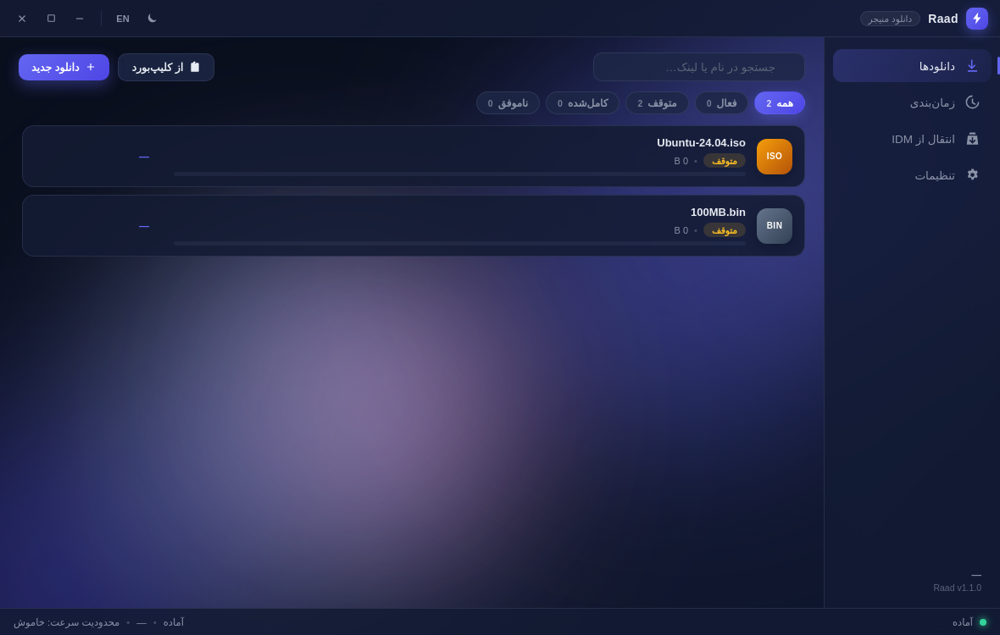
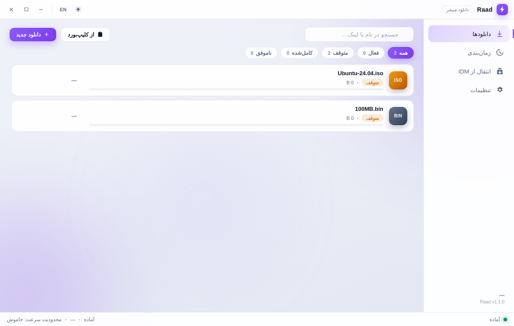

<div dir="ltr">

# ⚡ Raad — Modern Download Manager (IDM Alternative)

[](../../releases/latest)
[](../../releases)
[](https://www.electronjs.org/)
[](LICENSE)
[](#-features)

**[نسخه فارسی 🇮🇷](README.fa.md)**

**Raad** (pronounced *ra'ad*, Persian for **Thunder**) is a modern, open-source download manager built with **Electron** — designed as a practical IDM replacement: multi-segment engine, pause/resume, scheduler, clipboard batch import, Chrome/Firefox extensions with an IDM-style floating download window, and real IDM history migration.

> **Portable, not installer.** Download `RaadDM-Portable-x.x.x.exe` from [Releases](../../releases/latest), double-click, done. All data lives in a `Raad-Data` folder next to the exe.

| Downloads | Animated theme (Aurora) |
|---|---|
|  |  |

| Appearance settings | Floating download window (IDM-style) |
|---|---|
|  |  |

</div>

<div dir="rtl">

---

## ✨ امکانات

- 🚀 **موتور دانلود چندتکه** — تا ۳۲ اتصال موازی برای هر فایل، مثل IDM
- ⏸ **توقف / ادامه / از سرگیری** — حتی بعد از بستن برنامه (state file کنار فایل)
- 📥 **صف دانلود** — تعداد دانلود همزمان قابل تنظیم + شروع/توقف گروهی
- 🗂 **دسته‌بندی خودکار** — Video / Music / Archive / Program / Document / Image
- 🐢 **محدودیت سرعت کلی** — بدون قطع دانلودها
- ⏰ **زمان‌بندی** — بازه‌های زمانی روزانه/هفتگی + خاموش‌کردن خودکار سیستم بعد از اتمام صف
- 📋 **مانیتور کلیپ‌بورد** — تشخیص خودکار یک یا چند لینک کپی‌شده + افزودن گروهی
- 🌐 **افزونه کروم و فایرفاکس** — کلیک روی لینک دانلود ← پنجره شناور رعد (تجربه IDM)؛ با یک کلیک روی آیکون افزونه فعال/غیرفعال می‌شود
- 🔄 **انتقال از IDM** — تاریخچه از فایل `UrlHistory.txt` خود IDM + تنظیمات از رجیستری
- 🎨 **ظاهر کامل قابل شخصی‌سازی** — تیره/روشن/سیستمی × ۳ قالب (شیشه‌ای، فلت، نرم) × ۶ رنگ آماده + رنگ دلخواه + **۵ تم پس‌زمینه متحرک** (شفق قطبی، ستاره‌باران، موج، ذرات، مش رنگی) + گردی گوشه‌ها + اندازه متن + شدت نور + حالت فشرده
- 🌍 **دوزبانه** — فارسی/انگلیسی با RTL/LTR خودکار؛ فونت وزیرمتن داخل بسته

## 🖼 تم‌های انیمیشنی

| شفق قطبی | ستاره‌باران | موج |
|---|---|---|
|  |  |  |

| ذرات | مش رنگی | حالت روشن |
|---|---|---|
|  |  |  |

*(متن همیشه روی پنل‌های واضح نمایش داده می‌شود — تم‌های متحرک فقط پس‌زمینه را زنده می‌کنند.)*

## 📥 نصب (بدون نصب‌کننده!)

1. از [Releases](../../releases/latest) فایل **`RaadDM-Portable-x.x.x.exe`** را دانلود کن.
2. دوبار کلیک کن — همین! (اجرای اول چند ثانیه طول می‌کشد چون برنامه خودش را در پوشه موقت باز می‌کند)
3. اگر SmartScreen هشدار داد: `More info → Run anyway` (فایل امضای دیجیتال ندارد).
4. حذف کامل = پاک کردن exe و پوشه `Raad-Data` کنارش.

## 🌐 افزونه مرورگر

| کروم / کرومیوم | فایرفاکس |
|---|---|
| `chrome://extensions` → Developer mode → **Load unpacked** → پوشه `extension/chrome` | `about:debugging#/runtime/this-firefox` → **Load Temporary Add-on** → `extension/firefox/manifest.json` |

بعد در برنامه: **تنظیمات ← افزونه مرورگر ← کپی JSON** و در پاپ‌آپ افزونه Paste کن.
- کلیک روی **دکمه بزرگ ON/OFF** در پاپ‌آپ افزونه = فعال/غیرفعال‌کردن شنود دانلود (روی آیکون هم بج OFF می‌آید)
- راست‌کلیک در صفحه ← «Disable/Enable Raad interception»

## 🔄 انتقال تاریخچه از IDM

IDM تاریخچه را در رجیستری نگه نمی‌دارد! روش درست (مطابق مستندات رسمی IDM):

| روش | توضیح |
|---|---|
| **خودکار** (همان ویندوز) | برنامه فایل `%APPDATA%\IDM\UrlHistory.txt` را می‌خواند + تنظیمات را از رجیستری — فقط IDM باید بسته باشد |
| **فایل** (هر سیستم‌عاملی) | فایل `UrlHistory.txt` را از رایانه قدیمی کپی کن و همین‌جا وارد کن |
| **لیست لینک** | خروجی متنی خود IDM از منوی `Tasks → Export` (یا هر فایل متنی لینک‌دار) |
| **تنظیمات** | Export کلید `HKEY_CURRENT_USER\Software\DownloadManager` از regedit و دادن فایل `.reg` |

## 🛠 Build از سورس

```bash
git clone https://github.com/abalfazljam/raad.git
cd raad
npm install
npm start            # اجرای مستقیم
npm run dist:win     # ساخت RaadDM-Portable.exe (ویندوز، پرتابل)
```

## 🧱 معماری

```
main/       → موتور دانلود، زمان‌بند، پل HTTP افزونه‌ها، پارسر IDM، پنجره اصلی
preload/    → bridge امن (contextIsolation) به‌صورت window.raad
renderer/   → UI (vanilla JS + CSS، بدون فریمورک) + پنجره شناور دانلود
extension/  → افزونه Chrome (MV3) و Firefox (MV2)
native/     → (اختیاری) هاست Native Messaging
scripts/    → ساخت آیکون، تست پارسر IDM، بسته‌بندی
```

- **بدون هیچ وابستگی runtime** — فقط Electron؛ موتور دانلود روی `electron.net`
- ذخیره‌سازی JSON اتمیک (بدون SQLite و بدون native module)
- پل افزونه‌ها: HTTP لوکال `127.0.0.1` با توکن امنیتی

## 📄 License

MIT — رایگان برای استفاده شخصی و تجاری. ساخته‌شده با ⚡ برای کاربران فارسی‌زبان و همه جای دنیا.

</div>
